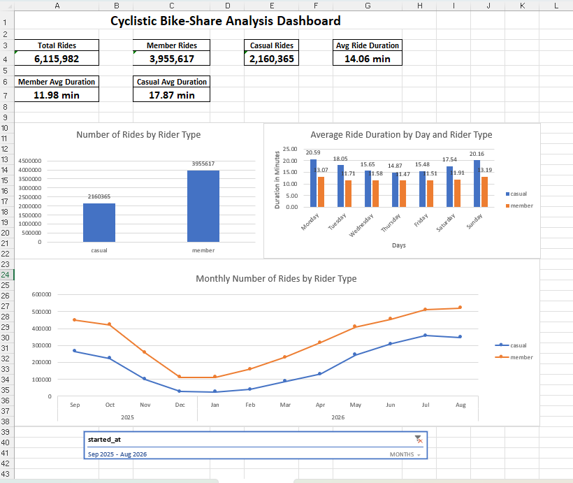

# 🚲 Cyclistic Bike-Share Analysis

## Project Overview

This project analyzes 12 months of Cyclistic bike-share trip data to understand how **casual riders** and **annual members** use the bike-sharing service differently.

The analysis focuses on ride volume, ride duration, day-of-week patterns, and monthly trends to identify opportunities for improving customer engagement and encouraging casual riders to become annual members.

## Dashboard



---

## 🎯 Business Task

The main objective is to understand:

- How ride volume differs between casual riders and annual members
- How ride duration differs between the two rider types
- Which days of the week have the highest riding activity
- How riding patterns change throughout the year
- How seasonal trends affect bike usage
- What patterns could support targeted membership marketing

---

## 📊 Dataset

The analysis covers **12 months of trip data from September 2025 to August 2026**.

The monthly datasets were combined using **Excel Power Query** into a single full-year dataset.

The combined dataset contains approximately **6.1 million rides**.

### Key columns used

- `started_at` – Ride start date and time
- `ended_at` – Ride end date and time
- `member_casual` – Rider type
- `ride_length` – Ride duration
- `ride_length_minutes` – Ride duration converted into minutes
- `day_of_week` – Numeric day identifier
- `day_name` – Day of the week

---

## 🛠️ Tools & Skills

### Tools
- Microsoft Excel
- Excel Power Query
- Excel Data Model
- PivotTables
- PivotCharts

### Data Analytics Skills
- Data cleaning
- Data transformation
- Data preparation
- Exploratory data analysis
- Aggregation and summarization
- Time-based analysis
- Seasonal analysis
- Data visualization
- Business insights

---

## 🔄 Data Preparation

The monthly datasets were combined using Excel Power Query.

The main preparation steps included:

1. Imported the 12 monthly datasets
2. Combined the files into one dataset
3. Standardized the data structure
4. Checked for missing and inconsistent values
5. Converted ride duration into numeric minutes
6. Created day-of-week fields
7. Loaded the large dataset into the Excel Data Model
8. Created PivotTables for analysis

Because the combined dataset contains more than one million rows, the data was analyzed through the **Excel Data Model** rather than loading the entire dataset into a worksheet.

---

## 📈 Analysis

The analysis examined four main areas:

### 1. Rider Type

Members made more rides than casual riders.

| Rider Type | Number of Rides |
|------------|----------------:|
| Member | 3,955,617 |
| Casual | 2,160,365 |
| **Total** | **6,115,982** |

### 2. Average Ride Duration

Casual riders had longer average rides than members.

| Rider Type | Average Ride Duration |
|------------|----------------------:|
| Member | 11.98 minutes |
| Casual | 17.87 minutes |
| **Overall** | **14.06 minutes** |

This indicates that members use the service more frequently, while casual riders tend to take longer individual trips.

### 3. Day-of-Week Patterns

The analysis showed differences in riding behavior across the week.

Casual riders were more active toward the weekend, while members had stronger riding activity during weekdays.

Average ride duration also varied across the days of the week.

### 4. Monthly & Seasonal Trends

Monthly ride activity was highest during the warmer months and lower during the winter period.

A comparison between January 2026 and July 2026 showed:

- **January 2026:** 11.62-minute average ride duration
- **July 2026:** 14.91-minute average ride duration
- **Full year:** 14.06-minute average ride duration

This suggests that seasonal conditions may influence bike usage and ride duration.

---

## 💡 Key Insights

### Member Usage
Annual members generated the majority of rides, accounting for approximately **64.7%** of all rides.

### Casual Rider Behavior
Casual riders represented approximately **35.3%** of rides but had a substantially longer average ride duration than members.

### Weekly Pattern
Casual riders showed stronger activity toward the weekend, while members showed relatively stronger weekday usage.

### Seasonal Pattern
Ride activity increased substantially from the winter months toward spring and summer.

The monthly analysis showed a clear seasonal pattern in both casual and member riding activity.

---

## 📊 Dashboard

The final Excel dashboard summarizes the main findings using:

- Number of rides by rider type
- Average ride duration by day and rider type
- Monthly number of rides by rider type
- Key performance indicators


---

## 📁 Project Structure

```text
Cyclistic-Bike_Share_Analysis/
│
├── README.md
│
├── Dashboard/
│   └── Cyclistic_Bike_Share_Analysis_Summary.xlsx
│
├── Data/
│   └── Monthly trip datasets
│
├── Documentation/
│   └── Case Study Journal
│
└── Screenshots/
    └── cyclistic-dashboard.png

## 🧠 Conclusion

The analysis demonstrates clear differences between casual riders and annual members.

Members account for the majority of rides and tend to take shorter trips, while casual riders take fewer but longer rides. Riding activity also changes across the week and throughout the year, with stronger overall activity during the warmer months.

These patterns can be used as a starting point for developing targeted strategies to better understand casual rider behavior and explore opportunities for increasing annual membership.

## 👨‍💻 About This Project

This project was completed as part of my data analytics portfolio to demonstrate practical skills in:

Excel | Power Query | Data Cleaning | Data Analysis | PivotTables | Data Visualization | Business Insights
